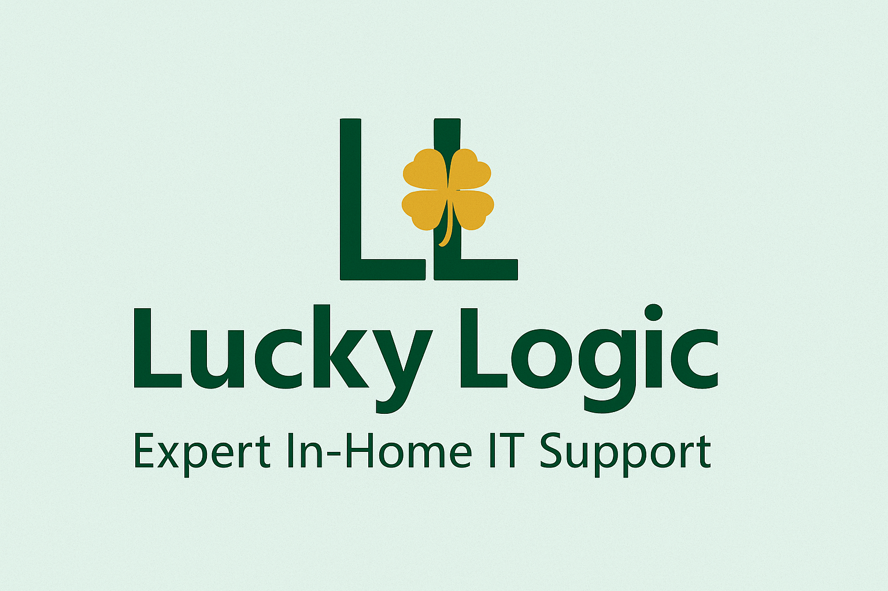

# 💻 Lucky Logic — Residential IT Support Services

Welcome to the official source code for **Lucky Logic**, a modern, responsive website for an Australian in-home IT support business. This site is built with **Next.js 14**, styled using **Chakra UI**, and deployed via **Netlify**.



---

## 🔧 Tech Stack

| Tech          | Purpose                                  |
|---------------|-------------------------------------------|
| Next.js 14    | React framework for routing + optimization |
| Chakra UI     | Accessible component library + styling    |
| TypeScript    | Safer code with type support              |
| Framer Motion | Animations and transitions                |
| Lottie React  | Lightweight animated SVGs (hero section)  |
| Netlify       | CI/CD and hosting                         |
| next-sitemap  | SEO-ready sitemap/robots.txt generation   |

---

## 🚀 Live Site

🔗 [https://luckylogic.com.au](https://luckylogic.com.au)

---

## 📁 Project Structure

```bash
├── app/                   # App Router structure
│   ├── layout.tsx        # Root layout with ChakraProvider
│   ├── page.tsx          # Home page content
├── components/           # UI components (Navbar, Footer, Hero, etc.)
├── public/               # Static files (images, sitemap, verification)
├── styles/               # Global CSS
├── theme/                # Chakra UI custom theme config
├── next.config.js        # Next.js export + image config
├── netlify.toml          # Netlify build + plugin config
└── package.json
```

✅ **Features**

- 🎨 Clean, accessible UI with Chakra
- ⚡ Smooth entrance animations with Framer Motion
- 🧠 SEO-optimised metadata, social cards, Open Graph images
- 📱 Fully responsive (mobile/tablet/desktop)
- 🛠️ Google Search Console verified
- 🗺️ Sitemap and robots.txt auto-generated
- 🧾 Ready to integrate Google Analytics or Tag Manager

---

## 🧪 Development Setup

1. **Clone the Repo**
   ```bash
   git clone https://github.com/Neesonn/luckylogicit.git
   cd luckylogicit
   ```
2. **Install dependencies**
   ```bash
   npm install
   ```
3. **Run locally**
   ```bash
   npm run dev
   ```
   Open your browser at http://localhost:3000

---

## 📦 Production Build

```bash
npm run build
```
To preview the build locally:

```bash
npm run start
```

---

## 🌐 Deployment

The site is deployed to Netlify using static export:

- `next.config.js` sets `output: 'export'`
- `netlify.toml` publishes the `out/` directory
- Deployment is triggered from the main branch

---

## 🌍 SEO

- `sitemap.xml` and `robots.txt` auto-generated with next-sitemap
- Open Graph + Twitter card support
- Google Search Console verified (`public/google*.html`)
- Friendly URL structure

---

## 📈 Coming Soon

- Google Analytics integration
- Contact form with Netlify Forms or Formspree
- Service-specific landing pages

---

## 🧑‍💻 Author

**Michael Neeson**  
📧 michaelneeson92@hotmail.com  
🔗 [https://luckylogic.com.au](https://luckylogic.com.au)

---

## 📄 License

This project is licensed under the MIT License.

---

Would you like me to:
- Include a section for Google Analytics setup?
- Add instructions for staging (`test` branch) deployment?
- Convert this to PDF for client/internal handover?

Let me know and I'll tailor it!